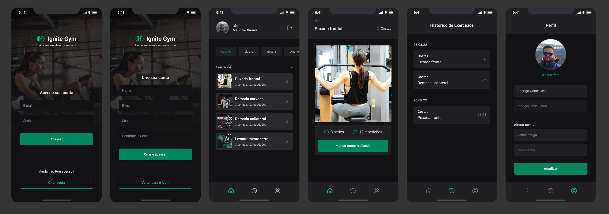

  

#### Screens

  

#### About the project

The idea of this application is to have an app where we can consult gym exercises. In this app we will have two types of navigations, a stacked navigation for public routes and a tabbed navigation at the bottom for private routes. To style this application we will use NativeBase, a library of stylized components to facilitate the creation of the app.

#### Technology

- [React Native](https://reactnative.dev/)
- [TypeScript](https://www.typescriptlang.org/)
- [Expo](https://expo.dev/)
- [NativeBase](https://nativebase.io/)
- [React Native](https://reactnative.dev/)
- [Axios](https://axios-http.com/ptbr/docs/intro)
- [Yup](https://www.npmjs.com/package/yup)
- [React Hook Form](https://react-hook-form.com/)
- [React Native SVG](https://github.com/software-mansion/react-native-svg)
- [React Native SVG Transformer](https://www.npmjs.com/package/react-native-svg-transformer?activeTab)
- [Expo Image Picker](https://docs.expo.dev/versions/latest/sdk/imagepicker/)
- [React Native Safe Area Context](https://github.com/th3rdwave/react-native-safe-area-context)
- [React Navigation](https://reactnavigation.org/)
- [React Navigation - Stack Navigator](https://reactnavigation.org/docs/native-stack-navigator/)
- [React Navigation - Bottom Tabs Navigator](https://reactnavigation.org/docs/bottom-tab-navigator/)
- [Async Storage](https://react-native-async-storage.github.io/async-storage/)
- [Babel Plugin Inline Dotenv](https://www.npmjs.com/package/babel-plugin-inline-dotenv)
- [Babel Plugin Module Resolver](https://www.npmjs.com/package/babel-plugin-module-resolver)

---

Made with :heart: by [Mauricio Girardi](https://www.linkedin.com/in/mauricio-girardi)
